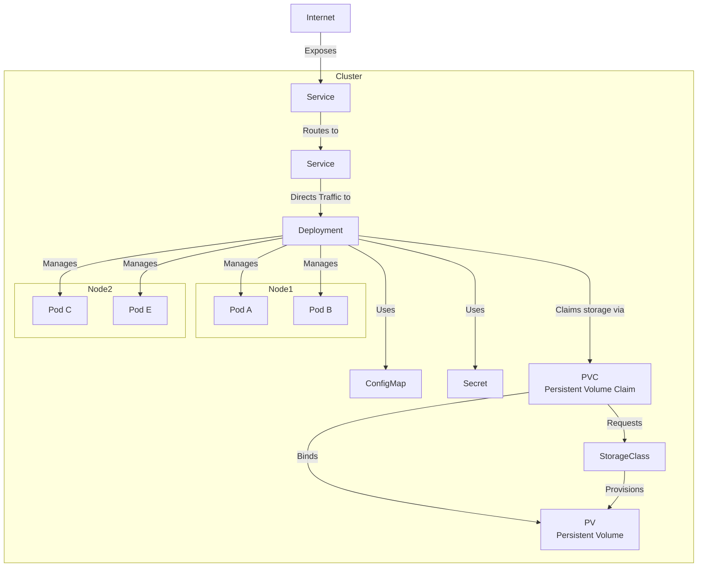

# Kubernetes
Graphs helping understand Kubernetes concepts and patterns.

## Relation between Service, Deployment, Nodes and Pods

---

**Ingresses** are not necessary. Alternatives:
- **NodePort**: Opens a port on each node to access the Service.
- **LoadBalancer**: Uses a cloud provider's load balancer to direct internet traffic to the Service.
- **Ingress**: Manages HTTP traffic and provides advanced routing capabilities for web applications.

**Storage Classes** don't necessarily need to be defined. A Storage Class in Kubernetes is a cluster-level resource that defines how and where persistent storage should be provisioned. They specify how to interact with physical storage, e.g. an SSD or a cloud provider's storage.
