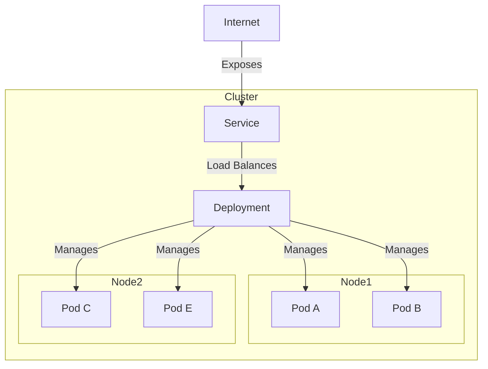

# Kubernetes
Graphs helping understand Kubernetes concepts and patterns.

## Relation between Service, Deployment, Nodes and Pods

```mermaid
graph TD;

subgraph Cluster
  subgraph Node1
    A[Pod A]
    B[Pod B]
  end
  subgraph Node2
    C[Pod C]
    E[Pod E]
  end
  D[Deployment]
  D -->|Manages| A
  D -->|Manages| B
  D -->|Manages| C
  D -->|Manages| E

  S[Service]
  S -->|Load Balances| D
end

I[Internet] -->|Exposes| S[Service]
```
