# Graph Types
Types of graphs of which I know that Mermaid supports them.

I believe there is more to most of the graphs that what I have depicted here.

## 1. Flowchart
With `flowchart`:
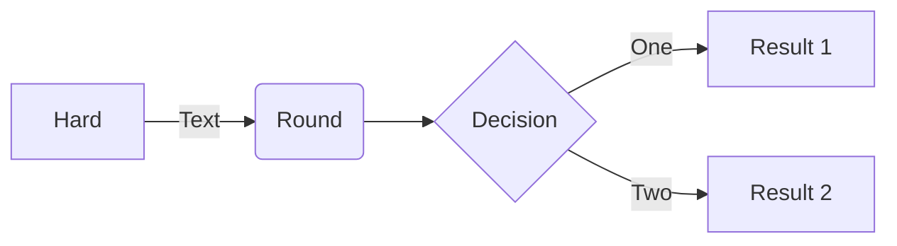

With `graph`:
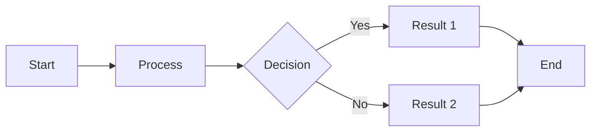

## 2. Sequence Diagram
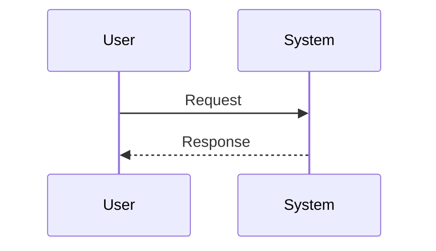

## 3. Gantt Chart
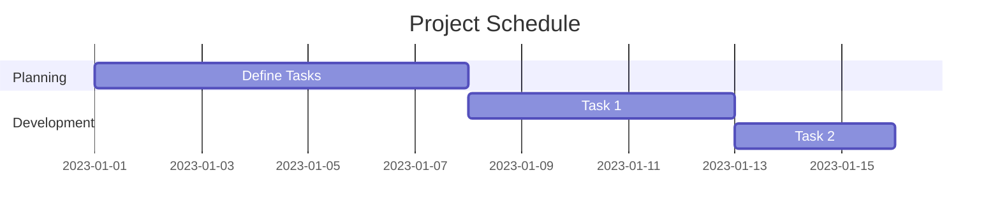

## 4. Pie Chart
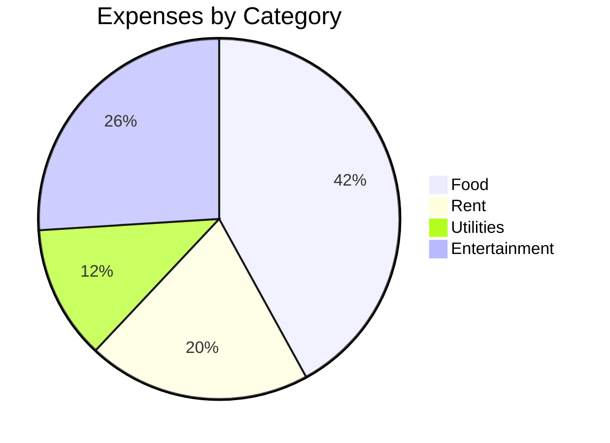

## 5. Class Diagram
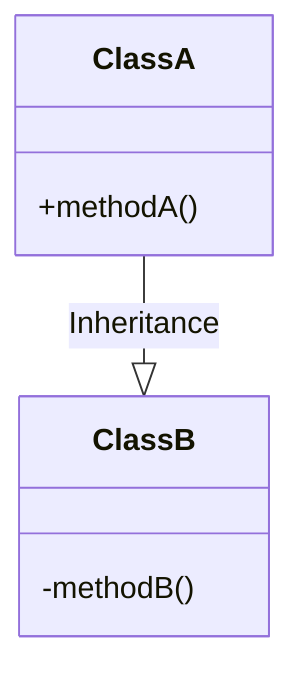

## 6. Entity-Relationship Diagram
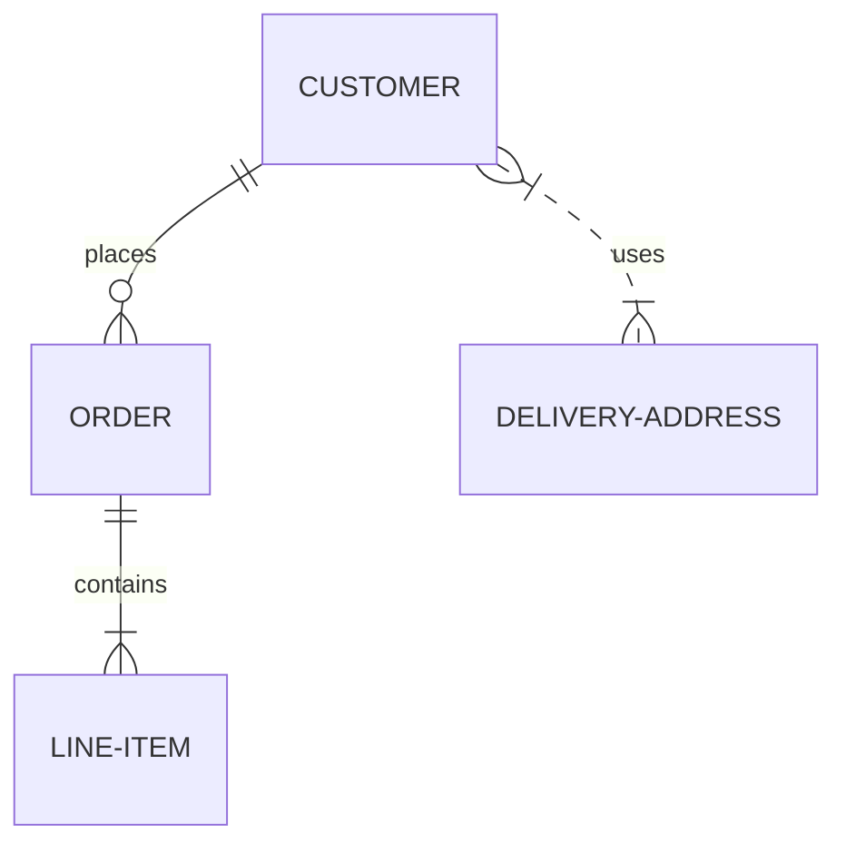

## 7. State Diagram
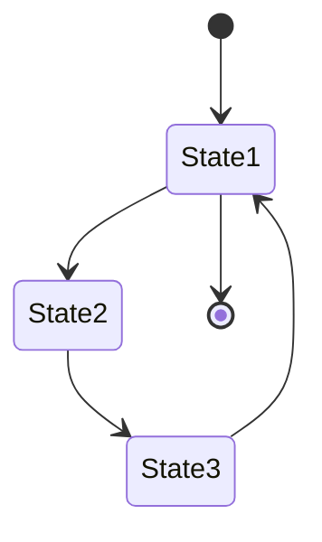

### 7.1. State Diagram 2
Don't know what's the difference to `stateDiagram` but here we are
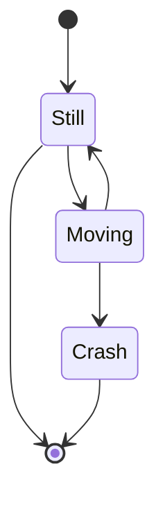

## 8. User Journey Diagram
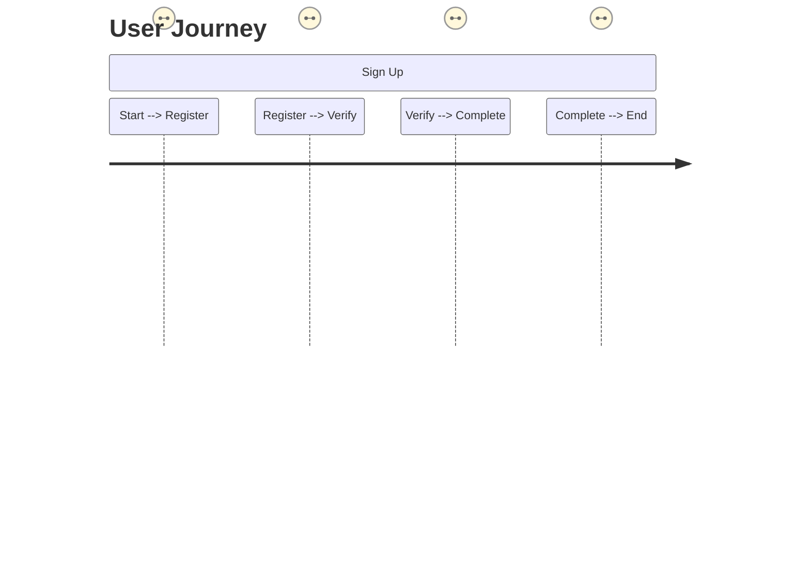

## 9. GitGraph

## 10. Mind Map
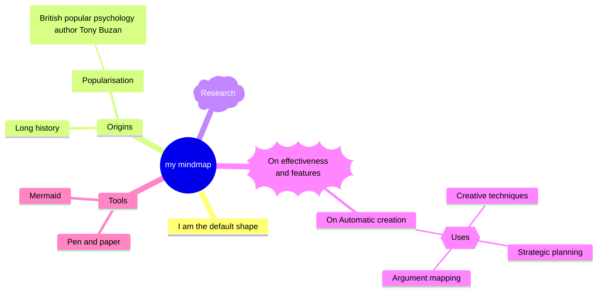

## 11. C4 Diagrams
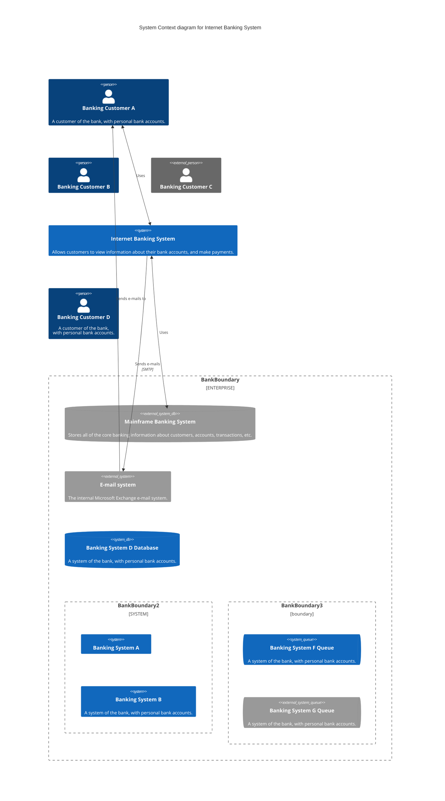