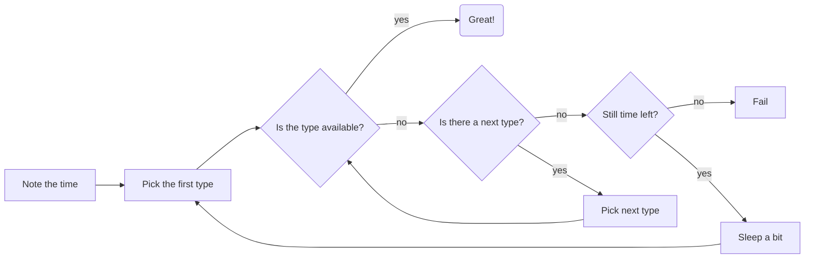
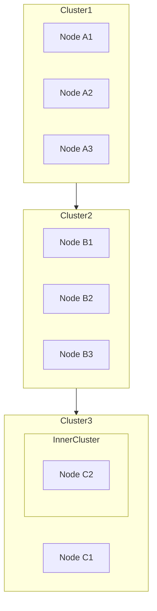

# Mermaid Hello
Showcase the usage of mermaid diagrams in Github Markdown.

See: https://mermaid-js.github.io/mermaid/#/

Mermaid renders nicely on GitHub, but not in a VSCode Markdown preview.
However, there is a VSCode Plugin to support Markdown Mermaid: https://marketplace.visualstudio.com/items?itemName=bierner.markdown-mermaid

"is p3.2xlarge working? No"
"is option g4dn.xlarge working? No"
"is option g4dn.2xlarge working? No"
"is option g4dn.4xlarge working? No"
"is the time since we first attemted to start an instance >n minutes ? No"
"sleep n seconds"
"is p3.2xlarge working? No"
...

Another example:

## Clustering Nodes, Subgraphs:
